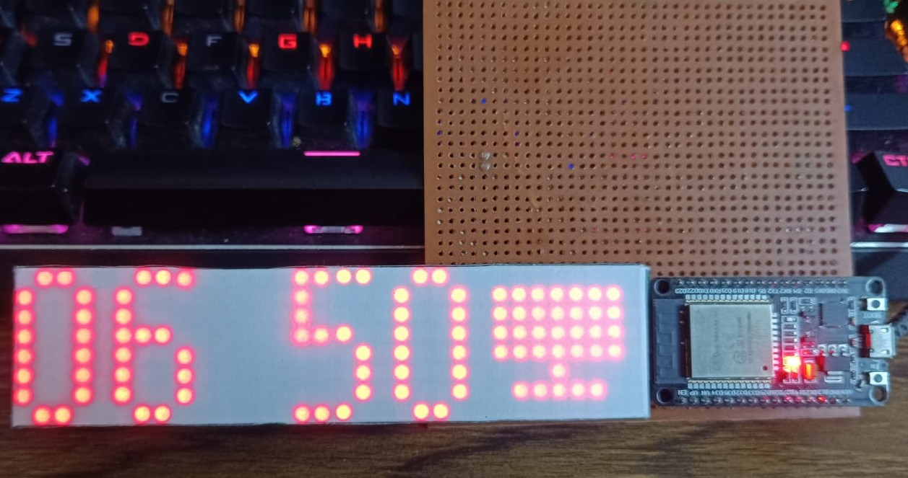

# QuickDisplay

#### USAGE
This is essentially a wifi enabled digital clock with buzzer. This will not work as expected without a backend running on a x86 machine.
Since wifi connected to backend, i've made an api to configure/show text or ring buzzer. so any self-hosted application can take advantage of this, like a cpu temp/freq monitor, or attach to home assistant, etc.

#### PURPOSE
This is a casual project just for the fun of using esp32 and MAX2719 ic from datasheet. Yup, i haven't used MAX2719 library to control the display, i used the datasheet to craete api of my own. It's cool to try out for the 1st time.

### IMPLEMENTATION DETAILS
* The self-hosted backend is used for 
    * Time synchronization
    * text to be displayed
    * start/stop sound ( yea, alarms can't be stored in the clock, but in the backend )
    * brightness control

### TODO
* Frontend (Web, nextjs preferrably)
* implement alarm in backend

### MAY GET DONE IN FUTURE
* add LDR to hardware, auto adjust brightness and report luminance data to homeassistant.
